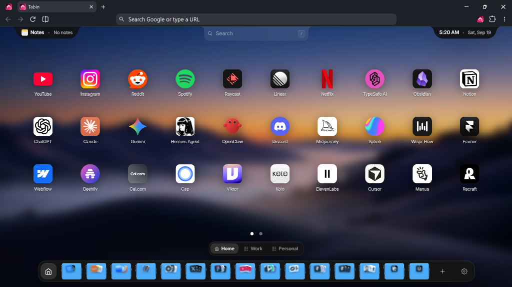

<div align="center">
  
  <h1>Tabin</h1>
  <p>A personal new tab for organizing bookmarks, websites, folders, saved tabs, and notes.</p>

  <p>
    <a href="#features"><strong>Features</strong></a> •
    <a href="#installation"><strong>Installation</strong></a> •
    <a href="#development"><strong>Development</strong></a> •
    <a href="#privacy"><strong>Privacy</strong></a> •
    <a href="https://x.com/ayushmxxn"><strong>Twitter / X</strong></a>
  </p>

  <br />

  
</div>

<br />

## Overview

Most new tab pages are either crowded with sponsored links and news feeds, or left completely blank. Bookmarks bars get cluttered quickly, and keeping dozens of tabs open just to save links for later eats up memory and adds mental noise.

**Tabin** is a fast, local-first extension that turns your browser's New Tab page into a clean, visual home for the sites you visit most.

Instead of digging through nested menus or hoarding tabs, Tabin gives you an organized dashboard where you can arrange links into spaces and folders, stash active tabs to free up memory, and jot down quick notes without leaving the page.

Everything runs directly on your device. There are no accounts, no cloud servers, and zero tracking. Your shortcuts, notes, and browsing sessions stay on your machine.

---

## Features

- **Visual Grid:** A clean shortcut grid with customizable columns and pagination.
- **Spaces & Folders:** Group links into dedicated workspaces (like Work, Personal, or Projects) and organize related sites into folders.
- **Quick Dock:** Pin your everyday sites and folders to a bottom dock for one-click access across spaces.
- **Saved Tabs & Sessions:** Save active tabs and tab groups to clear your browser window, then restore them individually or all at once.
- **Quick Notes:** A quiet scratchpad in the corner for jotting down thoughts, reminders, or temporary links.
- **Instant Search:** Press `/` anywhere on the new tab to filter through your shortcuts and folders instantly.
- **Right-Click Capture:** Save any open page directly to Tabin or straight into a folder using the browser context menu.
- **Automatic Metadata:** Automatically pulls high-resolution icons and site previews for your saved links.
- **Custom Backgrounds:** Choose from curated wallpapers, upload your own images, or set a subtle video background.
- **Import & Export:** Bring in your existing browser bookmarks (HTML) or export your entire setup as JSON.

---

## Installation

### Load Unpacked (Chrome, Edge, Brave, Arc)

1. Clone or download the repository:
   ```bash
   git clone https://github.com/ayushmxxn/tabin.git
   cd tabin
   ```

2. Install dependencies and build the extension:
   ```bash
   pnpm install
   pnpm build
   ```

3. Open your browser's extensions page:
   - **Chrome / Brave / Arc:** `chrome://extensions/`
   - **Edge:** `edge://extensions/`

4. Turn on **Developer mode** (top-right toggle).

5. Click **Load unpacked** and select the `.output/chrome-mv3` folder inside the project directory.

---

## Development

### Prerequisites

- [Node.js](https://nodejs.org/) (v20 or higher recommended)
- [pnpm](https://pnpm.io/) (v10.9.0 or higher)

### Getting Started

1. Clone the repository:
   ```bash
   git clone https://github.com/ayushmxxn/tabin.git
   cd tabin
   ```

2. Install dependencies:
   ```bash
   pnpm install
   ```

3. Start the development server:
   ```bash
   pnpm dev
   ```
   WXT will build the extension and launch a browser window with Tabin loaded and hot module replacement (HMR) active.

   To develop for Firefox:
   ```bash
   pnpm dev:firefox
   ```

### Available Scripts

| Command | Description |
|---|---|
| `pnpm dev` | Starts the WXT dev server for Chrome with live reload |
| `pnpm dev:firefox` | Starts the WXT dev server for Firefox |
| `pnpm build` | Compiles the production bundle to `.output/chrome-mv3` |
| `pnpm build:firefox` | Compiles the production bundle for Firefox |
| `pnpm compile` | Runs TypeScript type checking (`tsc --noEmit`) |
| `pnpm zip` | Packages the Chrome build into a distributable zip archive |
| `pnpm zip:firefox` | Packages the Firefox build into a distributable zip archive |

---

## Tech Stack

- **Framework:** [WXT](https://wxt.dev/) (Web Extension Framework)
- **Core:** [React 19](https://react.dev/) & [TypeScript](https://www.typescriptlang.org/)
- **Styling:** [Tailwind CSS v4](https://tailwindcss.com/) with `@tailwindcss/vite`
- **Animations:** [Motion](https://motion.dev/)
- **State Management:** [Zustand](https://zustand.docs.pmnd.rs/) (synced to local storage)
- **Icons & UI:** Lucide React icons, native CSS glassmorphism

---

<a id="privacy"></a>

## Privacy

Tabin is built strictly on local-first principles. Your browsing data belongs to you:

- **Saved on your machine:** All shortcuts, folders, settings, notes, and tab sessions are stored exclusively in your browser's local storage (`chrome.storage.local`).
- **No telemetry or tracking:** Tabin contains no analytics scripts, tracking cookies, or remote logging.
- **Direct requests:** Favicons and metadata are fetched directly between your browser and the respective websites, with no intermediary servers.

For full details, read the [Privacy Policy](PRIVACY.md).

---

## License

Tabin is open source software licensed under the [MIT License](https://opensource.org/licenses/MIT).
